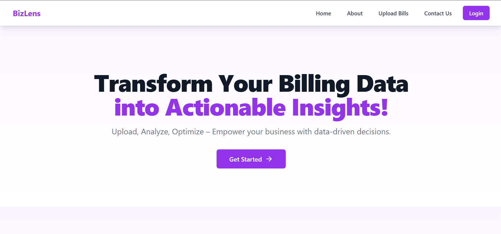

# 🚀 BizLens — Turn Bills into Business Brilliance

> *“Where data meets design, and insights power action.”*

**BizLens** is an intelligent full-stack analytics platform that transforms everyday business bills into deep, data-driven insights. Built with performance, scalability, and usability at its core — BizLens helps businesses visualize, understand, and act on financial patterns like never before.

---

## 🧠 Why BizLens?

✅ Manual bill tracking is inefficient  
✅ Traditional BI tools are complex and pricey  
✅ Business owners need **clarity**, not chaos  

**BizLens solves this:**

➡️ Upload a bill  
➡️ Instantly view categorized insights  
➡️ Make smarter decisions backed by data

---

## 🧱 Tech Stack Overview

| Layer     | Technology                             |
|-----------|----------------------------------------|
| Frontend  | React · TypeScript · Vite · Bootstrap  |
| Backend   | Spring Boot · MySQL · JWT Auth         |
| Tools     | Axios · Postman · IntelliJ · VS Code   |

---

## 🖥️ Frontend Highlights

- ⚛️ Built with modern **React + TypeScript**
- 🎨 Sleek **Bootstrap** UI with custom theming
- 📱 Responsive design for **mobile + desktop**
- ✅ Form validation + real-time feedback
- 🔐 Secure login with **JWT**
- 📊 Interactive dashboards powered by real data

---

## ⚙️ Backend Highlights

- 🧩 Clean layered structure (Controller → Service → Repository)
- 🔐 Secure endpoints using **JWT authentication**
- 🗃️ Integrated with **MySQL** for reliable data storage
- ✉️ DTO-based communication for cleaner APIs
- 📊 Analytics-driven endpoints for reporting

---

## 📸 Sneak Peek of Features

| Feature         | Preview Description                            |
|-----------------|-------------------------------------------------|
| ✍️ Login/Register | Secure, form-validated auth screens             |
| 📈 Dashboard      | Charts that summarize spending patterns         |
| 📤 Upload Bill    | Upload bills in PDF/text and extract data       |
| 🧾 Bill Viewer    | Neatly structured table with categorized info   |

---

## 🔍 Core Features

- 🔐 Secure user authentication (JWT)
- 📤 Upload and process bill data
- 📊 Auto-categorized analytics dashboard
- 🗓️ Filter data by day/month/year
- 🔎 Drill-down into individual expense types
- 📑 Export-ready views for future email/PDF reports

---

## 🔮 Planned Enhancements

- 🖼️ OCR support for **image-based bill scanning**
- 🧠 AI-powered **smart expense categorization**
- 📧 Auto-generated **PDF reports via email**
- 📅 Forecasting and budget reminders
- 👥 Role-based access control for teams

---

## 🤝 Contribution Guide

I welcome contributions! Here’s how you can get involved:

1. 🍴 Fork the project  
2. 📁 Create a feature branch (`git checkout -b feature-name`)  
3. 💬 Commit descriptive messages  
4. 📤 Push and open a PR  

---

## 📄 License

This project is licensed under the [MIT License](LICENSE).

---

